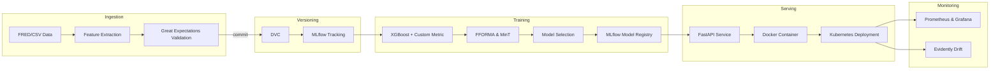

<!-- README for the Banking Forecast MLOps E2E Project -->

# Banking Forecast MLOps E2E

This repository contains a **full‑stack MLOps template** for a banking consumption forecasting use case.  It is designed for engineers and data scientists who want to showcase end‑to‑end best practices, from data ingestion to production deployment.  While the domain is banking, the structure is generic enough to serve as a starting point for other time‑series forecasting problems.

## Overview

The project implements a reproducible pipeline built around the following steps:

1. **Ingestion & Feature Extraction** – Pulls publicly available time‑series data (e.g. FRED, CSV files) and applies basic feature engineering.  Data validation is performed with **Great Expectations** to enforce quality and schema checks.
2. **Versioning** – Both data and models are versioned with **DVC** and experiment tracking is handled by **MLflow**.  Artifacts, parameters and metrics are logged for each run and the best model is registered in the MLflow model registry.
3. **Training & Selection** – Implements baseline models with **XGBoost 2.0** and includes a placeholder for advanced techniques like **FFORMA** and **MinT** reconciliation for hierarchical forecasting.  Custom metrics can be defined for business‑specific evaluation.
4. **Orchestration** – The workflow is managed by **Prefect**, defining tasks for each step (ingest → validate → train → evaluate → register → deploy).  Prefect flows can be executed locally or scheduled on a server.
5. **Serving** – A lightweight **FastAPI** app exposes a `/predict` endpoint and a `/health` check.  The service is containerised via **Docker** and can be deployed to Kubernetes with the provided manifests and Helm chart.
6. **Observability** – Integrates **Evidently** for drift detection and quality monitoring, and exposes Prometheus metrics for latency and error rates.  Dashboards can be built with **Grafana** for real‑time insights.
7. **CI/CD** – GitHub Actions automate testing, linting, type checking, container builds and nightly retraining jobs.  Secrets are injected via the repository settings and an example `.env.example` file documents required environment variables.

## Architecture

Below is a simplified Mermaid diagram illustrating the high‑level data and model flow.  To render this diagram in Markdown, use a Mermaid plugin or view it directly in GitHub.



## Quick Start

```bash
# set up a virtual environment and install dependencies
make setup

# run data ingestion, validation and training in one go
make train

# start the FastAPI server locally
make serve

# run unit and integration tests
make test
```

### Example Request

Once the service is running locally, you can submit a request to the prediction endpoint using `curl`:

```bash
curl -X POST -H "Content-Type: application/json" \
     -d '{"features": [123.4, 56.7, 89.0]}' \
     http://localhost:8000/predict
```

## Repository Structure

The repository follows a conventional Python project layout with additional directories for data, models and infrastructure:

```
banking-forecast-mlops-e2e/
├─ README.md
├─ LICENSE
├─ requirements.txt            # main dependencies
├─ constraints.txt             # pinned versions for reproducibility
├─ Makefile                    # common commands (setup, train, serve, test)
├─ .pre-commit-config.yaml
├─ .env.example                # environment variables template
├─ .github/
│  └─ workflows/
│     ├─ ci.yml                # CI pipeline: test, lint, build
│     └─ nightly-retrain.yml   # nightly retrain and validation
├─ data/
│  ├─ raw/                     # empty, tracked by DVC
│  └─ processed/               # empty, tracked by DVC
├─ dvc.yaml                    # defines DVC stages
├─ models/                     # .gitignore; models stored via DVC/MLflow
├─ mlruns/                     # .gitignore; MLflow runs if stored locally
├─ src/
│  ├─ config/                  # YAML configs for paths, parameters
│  ├─ features/                # feature engineering scripts
│  ├─ training/                # training loops, hyper‑parameter search
│  ├─ evaluation/              # evaluation and backtesting
│  ├─ reconcile/               # hierarchical reconciliation (MinT)
│  ├─ serving/                 # FastAPI app and pydantic schemas
│  └─ monitoring/              # drift detection and metrics exporters
├─ infra/
│  ├─ docker/
│  │  └─ Dockerfile            # container definition
│  ├─ k8s/
│  │  ├─ deployment.yaml
│  │  ├─ service.yaml
│  │  └─ hpa.yaml
│  └─ helm/                    # optional helm chart
├─ expectations/               # Great Expectations suites
├─ notebooks/                  # exploratory notebooks (not in production flow)
└─ tests/
   ├─ unit/
   └─ integration/
```

## Badges & Demo

Add CI status and coverage badges to the top of this README once the GitHub Actions workflows are operational.  Consider including a GIF that shows the API responding to a request, and demonstrate a simulated canary deployment or rollback using the provided Helm chart.

## Contributing

Contributions are welcome!  Please open an issue to discuss your ideas before submitting a pull request.  See the code of conduct and licence for guidelines.

## License

This project is licensed under the MIT License.  See the [LICENSE](LICENSE) file for details.